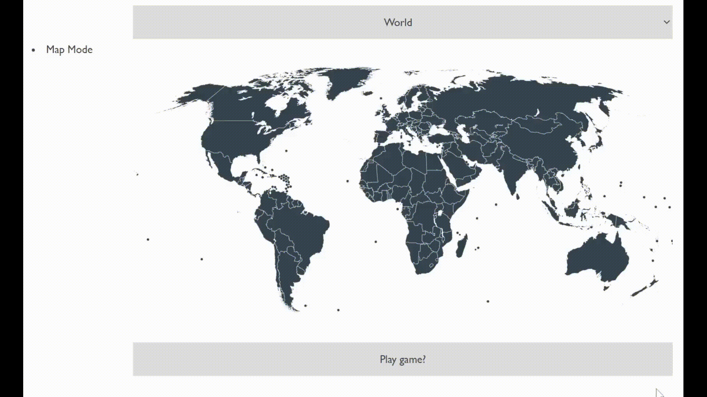

# Super Map

This is the prototype of a game that will be made.

## Instructions

Place the cursor on a country or region. It will be highlighted and a corresponding name and code will appear in the lower bar.

### Map origin

The image is based on the map in "https://commons.wikimedia.org/wiki/File:BlankMap-World-Compact.svg" obtained 6:th of December 2021, which was released into the public domain.

The maps for Africa and Europe were obtained from the following links.

https://commons.wikimedia.org/wiki/File:BlankMap-Africa.svg
https://commons.wikimedia.org/wiki/File:Blank_map_of_Europe_(without_disputed_regions).svg

### Other

Certain regions which have their own codes in the maps do not appear as marked in the application. This will be fixed.
